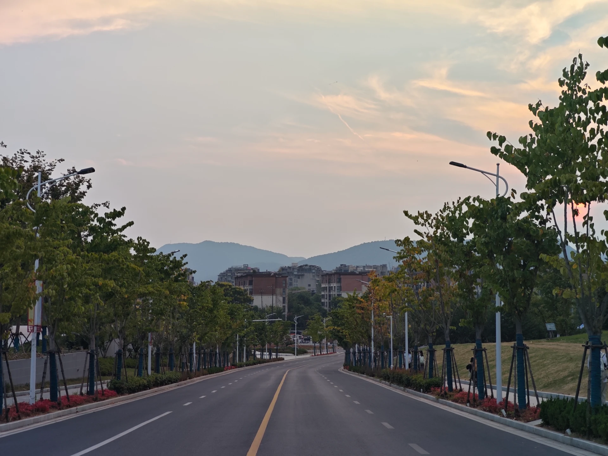

    路灯亮了，风还是闷得慌。
    军训第一天，鞋底烫得站不住，现在腿肚子还泛酸。从北方跑过来，最受不了这南方的天，像捂着一层水。耳边飘过的方言一句听不懂。想家里的冷风了，干爽，刮脸。
刚在食堂角落，一个人吃黄焖鸡。窗口人多，三五成群的，我转了一圈不知道点什么，随便要了这锅。砂锅推过来，边上滋滋响。汤黑乎乎的，鸡块上漂着几块青椒。热气扑脸，我咽了下口水。夹起一块带皮的，没管烫，直接塞嘴里。又扒了一大口米饭，烫得直哈气，就是停不下来。真他妈好吃。教官在隔着几桌的地方坐着，我吃我的。吃完就剩几块凉掉的香菇。
    回宿舍走得慢，脚踩在格子砖上，一块，两块。路宽得有些空旷。树剪得齐整，一根根直挺挺戳着。远处的山看不见了，天全黑下来。旁边楼的大玻璃墙亮起一格一格的灯，没什么人。不想回去。
手机震了下。水群里面发来两条@全体成员，没别的。行，懒得回。
到楼下，门缝透着光。推门进去。
    “你们在哪吃的？”
