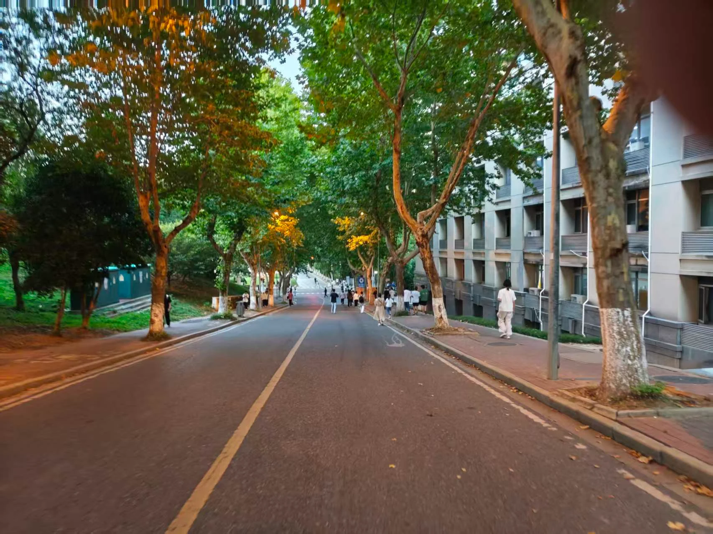

    我们习惯把开学变成下马威。新生面对图书馆的门、食堂的窗口、桂花树的香，一脸茫然。人被拉到操场上。晒黑的脸，嘶哑的嗓子。完成一场吃苦、纪律、服从的集体叙事。
    我们告诉他“你应该成为什么”。给他弄清“我站在哪里”的时间，少。
    幸福，从“我站在哪里”开始。
    这个时代，幸福被说成矫情、低效、缺乏狼性。我们赞美凌晨的灯，绷紧的肌肉，苦其心志的大词。我们羞于承认：归属感从一条走熟的路、一扇窗外的晚霞、一个发呆的角落开始。
第一周暂停军训，放假。把校园还给学生。让他认一认教学楼的爬山虎，踩一踩篮球场傍晚的地面，在图书馆拐角看夕阳把城市染成橙色。这些事无用。校园区别于营地。这里要有林荫道和晚风，缺少集结号和口令。
    磨砺有它的价值。年轻人需要学会在烈日下站直，在困倦中坚持，在集体里收起个人主义。磨砺的前提，是他站在这片土地上，心里有可守护的东西。先有归属，后有纪律。先有安全感，后有战斗力。
    如果一个人对食堂出口感到陌生，缺少一个安静角落，响亮的口号，沦为浮尘。
    幸福具体。远离“为中华之崛起而读书”的宏大誓言。是开学第一周，梧桐树下，遇见一个同样迷路的人。你们找到巷子里的便利店。多年后，你忘了正步，忘了军姿。记得那个下午的风，身边人递来的水，记得自己第一次觉得：这里可以是我的地方。
    教育拒绝把不同的人变成同一种人。让每个人成为自己。他有余力去爱这个国家，去扛值得扛的重。一个来不及熟悉校园的人，拿什么熟悉自己？
    把吹哨的冲动按下。让第一周慢下来。幸福追上那些抵达的脚步。
    愿更多学校把时间还给新生。愿这个怀疑的时代，我们信一张安静的书桌，一条慢走的路。信一个人安顿好身心，才走向远方。
    世上有许多伟大的事。此刻，为这件小事鼓掌。
